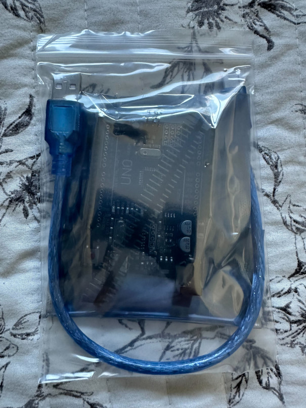
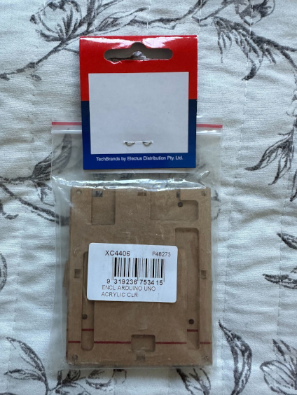
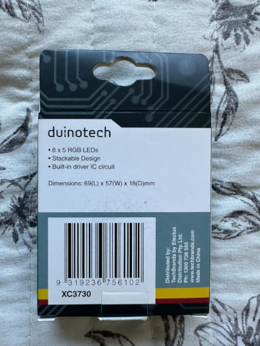
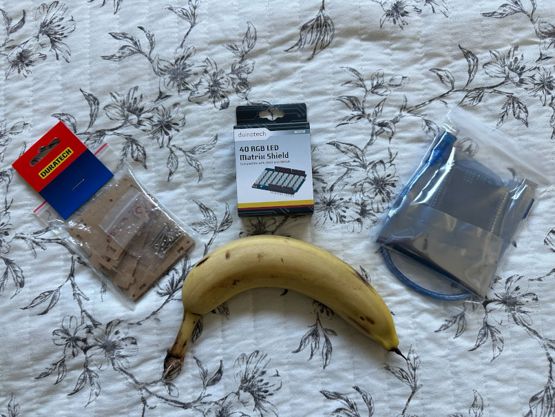

# miniLightShow

**A RGB light with various patterns and effects based on Arduino and Duinotech 40 LEDs matric shield**

A nice weekend project for beginners, affordable, fun and no soldering required.

## Parts

- 1 x Arduino Uno/Leonardo
- 1 x Duinotech XC3730 40 RGB LED Matrix Shield
- 1 x Duratech XC4406 acrylic enclosure for Arduino Uno
- 1 x weekend
- 1 x fresh banana

## Assembly

1. Gather the parts

  

2. Test the Arduino Uno/Leonardo

3. Assemble the enclosure

4. Plug the RGB LED hat on top of the Arduino

5. Upload the code

6. Test

7. 3D print the light diffuser (optional)

## Programming

## Troubleshooting

